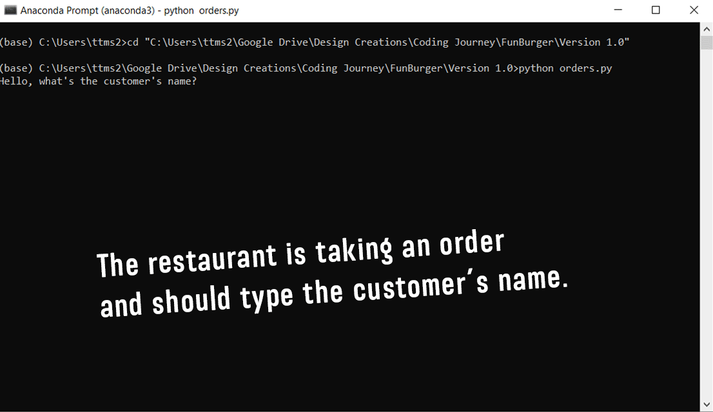

# FunBurgerApp Project

FunBurgerApp is a restaurant order management system through CLI.

## Instructions

```python
import googlemaps, re
import db_connect

gmaps = googlemaps.Client(key='CHANGE THIS TO YOUR PERSONAL KEY TO MAKE IT WORK AGAIN')
```

## Demo


